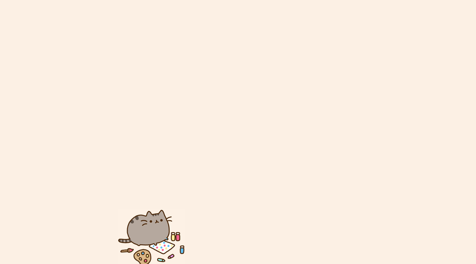

# Pusheen Screensaver

Is it a good idea to write a screensaver in Java? Probably not. Nevertheless, this is the language that I knew in high school, and so this is what I wrote it in.

## Usage
For the most part, either compile to a jar or download the pre-built jar and run it. If you want to set it as your screensaver on windows, download a jar to exe program, convert the jar to an exe, and set the screensaver to the exe.

## Functionality
Shows Pusheen walking back and forth on the bottom of your screen. He will occasionally stop and do things. Automatically takes up the full screen. To exit, move the mouse.

## Project Layout
* `Screensaver.java` is the main class that kicks everything off. It gets the screen dimensions, creates a new `Pusheen` (which is an implentation of a `DoubleBufferedCanvas`), and sets up a `mouseListener` to kill the program upon mouse movement.
* `Pusheen.java` contains the logic for tracking Pusheen, making him do things, and painting the canvas. `Pusheen` is an implementation of `DoubleBufferedCanvas`.
* `DoubleBufferedCanvas.java` is a more rudimentary implementation of the `DoubleBufferedCanvas` that appears in Dodge. It is my personal implementation of a pseudo-double buffered canvas and an abstract `Runnable` interface. The constructor must be supplied a desired fps target, and the `DoubleBufferedCanvas` will attempt to match that rate.

[Pusheen the Cat](http://www.pusheen.com/) is copyright 2010-2015 and all art assets are not my work.